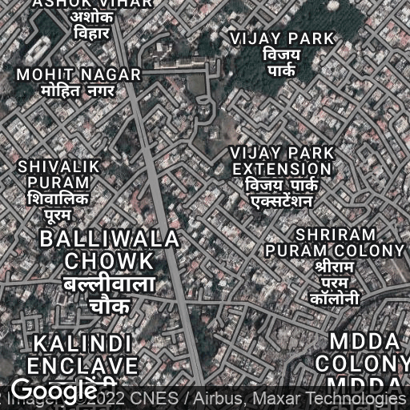
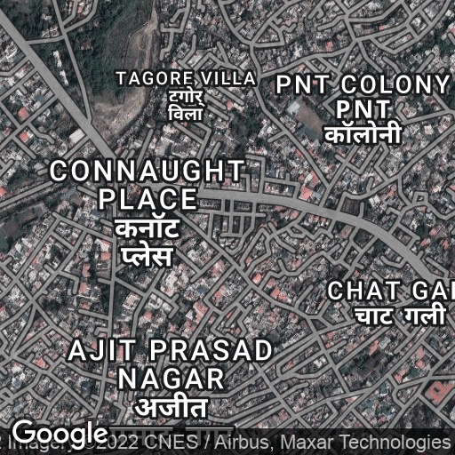

# Capture Maps Backend API

This API captures detailed images of an area
using [Google Maps Static API](https://developers.google.com/maps/documentation/maps-static/overview)

> This API is intended to be consumed by [Capture Maps UI](https://github.com/zxcV32/capture-maps-ui). However, it is may be consumed by other systems as is.

## Setup

1. Create `.env` in the project root and store Google Maps Static API
   `API_KEY=<YOUR API_KEY>`
2. Run project
   `go run src/main.go`

## Sample request

```http request
POST /print

{
    "lat": 30.316963, 
    "lng": 78.032560,
    "zoom": 15,
    "radius": 5
}
```

## Sample Response


> What about the watermark?
> According to [Google Maps Platform Terms of Service](https://cloud.google.com/maps-platform/terms)
> , the branding, logos, and copyright and trademark notices can not be removed. :'(

## How does it work?

> TODO explain

1. Latitude and longitudes are converted to Google maps tile coordinates (the first tile is the
   centre)
2. The specification (the level of details and area it covers) is defined by the combination
   of `zoom`, `scale` , and `pixels` (`scale` and `pixels` are internally configured)
3. The tiles coordinate around the center tile is calculated using the `radius`. The `radius` is
   number of tiles from the center tile (inclusive)
4. The tiles are then joined together and to construct a single detailed image
5. Then do the same north and south to the center row

For example, the centre row of the complete grid consists individual tiles collected from west to
east with length `2 * radius - 1`

| c1 | c2 | c3 | c4                  | c5 | c6 | c7 | c8                  | c9 |
|-----|-----|-----|---------------------|-----|-----|-----|---------------------|-----|
|     |     |     |   |     |  |  |   |  |

After stitching the tiles we get the centre row

